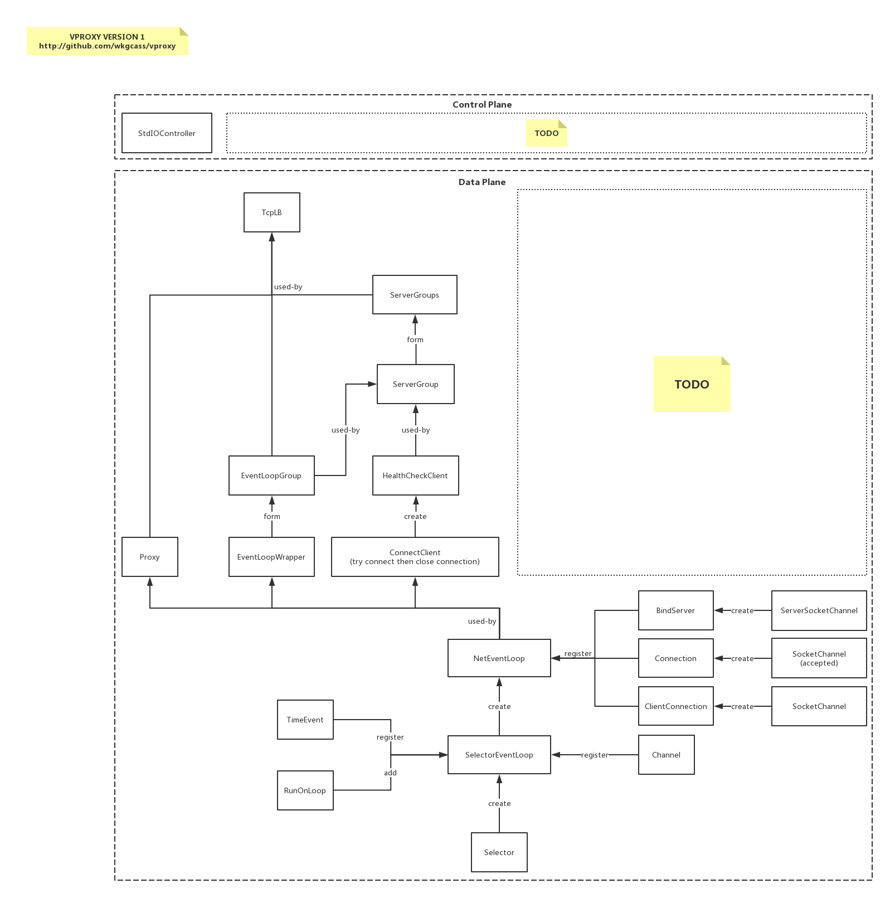

# vproxy

## Intro

VProxy is a zero-dependency TCP Loadbalancer based on Java NIO. The project only requires Java 8 to run.

Clone it, javac it, then everything is ready for running.

## Aim

* Zero dependency: no dependency other than java standard library.
* Simple: keep code simple and clear.
* Modifiable when running: no need to reload for configuration update.
* Fast: performance is one of our main priorities.
* TCP Loadbalancer: we only support TCP for now.

## How to use

### Doc

* [how-to-use.md](https://github.com/wkgcass/vproxy/blob/master/doc/how-to-use.md) How to use config file and controllers.
* [command.md](https://github.com/wkgcass/vproxy/blob/master/doc/command.md): Detailed command document.
* [lb-example.md](https://github.com/wkgcass/vproxy/blob/master/doc/lb-example.md): An example about running a loadbalancer.

### Quick Start

Create a file, input the following:

```
add event-loop-group elg0
add server-groups sgs0
add tcp-lb lb0 acceptor-elg elg0 event-loop-group elg0 addr 127.0.0.1:8899 server-groups sgs0 in-buffer-size 256 out-buffer-size 256
add event-loop el0 to event-loop-group elg0
add server-group sg0 timeout 1000 period 3000 up 4 down 5 method wrr event-loop-group elg0
add server-group sg0 to server-groups sgs0
add server s0 to server-group sg0 address 127.0.0.1:12345 ip 127.0.0.1 weight 10
```

and save it, perhaps you can save it into `~/vproxy.conf`.

Start the application via `net.cassite.vproxy.app.Main`

```
java net.cassite.vproxy.app.Main load ~/vproxy.conf
```

Then everything is done.

### Use redis-cli

You can create a `RESPController` via stdIO, then all commands will be available in your `redis-cli` client.

Input the following command in your vproxy application via standard input:

```
System call: add resp-controller r0 addr 0.0.0.0:16379 pass 123456
```

which creates a `RESPController` instance named `r0` listens on `0.0.0.0:16379` and has password `123456`.

Then from any endpoint who has access, you can run this to operate on the vproxy:

```
redis-cli -p 16379 -h $THE_VPROXY_HOST_IP_ADDRESS -a 123456 [$YOU_CAN_ALSO_DIRECTLY_RUN_COMMANDS_HERE]
```

You should know that the `help` is trapped by `redis-cli` (which will return redis-cli's help message), so we give a NEW command named `man`, it will return the same message as using `help` in stdIO.

### Detailed Phases via stdio or redis-cli, Step by Step

To create a tcp loadbalancer, you can:

1. start the application via `net.cassite.vproxy.app.Main`
2. type in the following commands or run from the redis-cli:
3. `add event-loop-group elg0`  
    which creates a event loop group named `elg0`, you can change the name if you want
4. `add server-groups sgs0`  
    which creates a serverGroups named `sgs0`. The serverGroups is a resource that contains multiple server groups.
5. `add tcp-lb lb0 acceptor-elg elg0 event-loop-group elg0 addr 127.0.0.1:8899 server-groups sgs0 in-buffer-size 256 out-buffer-size 256`  
    which creates a tcp loadbalancer named `lb0`, using `elg0` as its acceptor event loop group, using also `elg0` as its worker event loop group. the lb listens on `127.0.0.1:8899`, using `sgs0` as it's backend server groups. the input buffer size and output buffer size are both set to 256 bytes.

> However it's recommanded to set a bigger buffer size, e.g. 16384.

Now you get a tcp loadbalancer but it's not currently running.  
A event loop should be created for it to run.

1. `add event-loop el0 to event-loop-group elg0`  
    which creates a event loop named `el0` inside `elg0`. Creating inside `elg0` is because the lb is using `elg0` as its event loop group. If your acceptor event loop group and worker event loop group are not the same, you should create event loop for both event loop groups.

Now the lb is running, you can telnet, however there are no valid backends, so the connection is closed instantly.

To add a backend, you can:

1. `add server-group sg0 timeout 1000 period 3000 up 4 down 5 method wrr event-loop-group elg0`  
    which creates a server group named `sg0`; the health check configurations are: check timeout is 1 second, check every 3 seconds, consider the server UP when got 4 successful checks and consider the server DOWN when got 5 failed checks; the method of retrieving server from this group is `wrr`
2. `add server-group sg0 to server-groups sgs0`  
    which adds the server group `sg0` into serverGroups `sgs0`. Adding `sg0` to `sgs0` is because the tcp-lb is using `sgs0` as its backend server groups
3. `add server s0 to server-group sg0 address 127.0.0.1:12345 ip 127.0.0.1 weight 10`  
    which adds a new server named `s0` into server group `sg0` with remote address `127.0.0.1:12345`, and you want to visit it via `127.0.0.1`, the weight of the server in this group is `10`

You may expect a log telling you that the server you just added is turned to UP in a few seconds. Then the loadbalancer is ready for connections.

### Explanation

VProxy provides you with full control of inside components.  
As a result, the configuration is a little different from what you may have thought.

VProxy has a very simple configuration syntax.

```
$action $resource-type [$resource-alias] [in $resource-type $resource-alias [in ...]] [to/from $resource-$type $resource-alias] $param-key $param-value $flag
```

Here's a example:

```
add server myserver0 to server-group group0 address 127.0.0.1:12345 ip 127.0.0.1 weight 10
```

which says that: I want to add a server named `myserver0` into server group `group0`, whose address is `127.0.0.1:12345` and I want to visit this address via ip `127.0.0.1`, the server's weight in this group is set to `10`.

You can use `help` command to check all available resources and params.

> `flag`s are not used for now, but is part of syntax for further extension.

VProxy does not provide configuration like nginx or haproxy, it looks more like ipvsadm. You can have full control of all low level components such as threads and event loops. Also you can modify all components during the runtime without a reload.

## Architecture



### Data Plane

Let's start from the bottom.

Everything is based on java nio `Selector`.

#### SelectorEventLoop

We first built the `SelectorEventLoop`. It provides a common callback handler wrapper for `Channel` events. Also the loop can handle time events, which is based on `selector.select(timeout)`.  
You may consider it in the same position as libae in redis.

#### NetEventLoop

Then we built `NetEventLoop` based on `SelectorEventLoop`, and provided a few wrappers for `SocketChannel`s, as you can see from the architecture figure. This makes network related coding easy and simple.  
Also, vproxy provides a `RingBuffer` (in util package, used in almost every component), which can write and read at the same time. The network handling is simple: you write into output buffer, then the lib writes that data to channel; when reading is possible, the lib calls your readable callback and you can read data from the input buffer.

We start to build the lb part after having these two event loops.

#### Proxy

The `Proxy` can accept connections, dispatch the connections on different loops, create connections to some remote endpoints, and then proxy the network data.  
The accept eventloop, handle eventloop (for handling connections), which backend to use, are all configurable and can be changed when running.

#### EventLoopWrapper

`EventLoopWrapper` is nothing more than a wrapper for NetEventLoop. It keeps registered channel data for statistics and management. Also it can bind resources, which will be alerted on removal or when event loop ends.

#### EventLoopGroup

`EventLoopGroup` contains multiple `EventLoopWrapper`. Also it can bind resources, just like `EventLoopWrapper`. It provides a `next()` method to retrive the next running event loop. The method of selecting event loop is always RR.

#### ConnectClient

`ConnectClient` is a client that connects to the remote endpoint then closes that connection. It is registered with a callback, which will alert you whether the connection is ok or failed or timed-out.

#### HealthCheckClient

`HealthCheckClient` is a client that connects to remote endpoint periodically, and check whether that endpoint is online. It is registered with a handler, which will alert you when the target endpoint is switched to DOWN or UP (the trigger is Edge Trigger).

#### ServerGroup

`ServerGroup` is a group of endpoints, each endpoint is attached with a boolean flag indicating it's currently healthy or not. The `ServerGroup` provides a `next()` method to retrieve the next healthy server. The method of determining which is the "next" is configurable (currently only `wrr` is supported, will add more in the future).

#### ServerGroups

`ServerGroups` is a list of groups, each group is assigned with a weight. It's nothing but a container and does not do IO it self. It provides a `next()` method, which will go throught all serverGroups and retrieve a healthy server. The method of selecting serverGroup is always WRR, and it doesn't affect how `ServerGroup` selects server.

#### TcpLB

`TcpLB` listens on a port and does loadbalancing. You can create multiple `TcpLB`s if you want to listen on multiple ports.

### Control Plane

VProxy will create a event loop named `ControlEventLoop` for controlling operations. All quick operations will be operated on this event loop, some operations that might take a very long time will be operated on new threads.

VProxy provides you with multiple ways of configuring the vproxy instance.

#### StdIOController

`StdIOController` provides the way of controlling the vproxy process via standard input and output. It simply starts a `Scanner` to watch your commands on a new thread. Results, errors or logs will be printed to the stdout or stderr.

#### RESPController

`RESPController` listens on a port and uses the REdis Serialization Protocol for transporting commands and results. You can use `redis-cli` to manage the vproxy instance.

## The End

In this article, all `we` means who participated in `vproxy`. Currently only stands for `I` myself. I would be happy if you want to join :)
